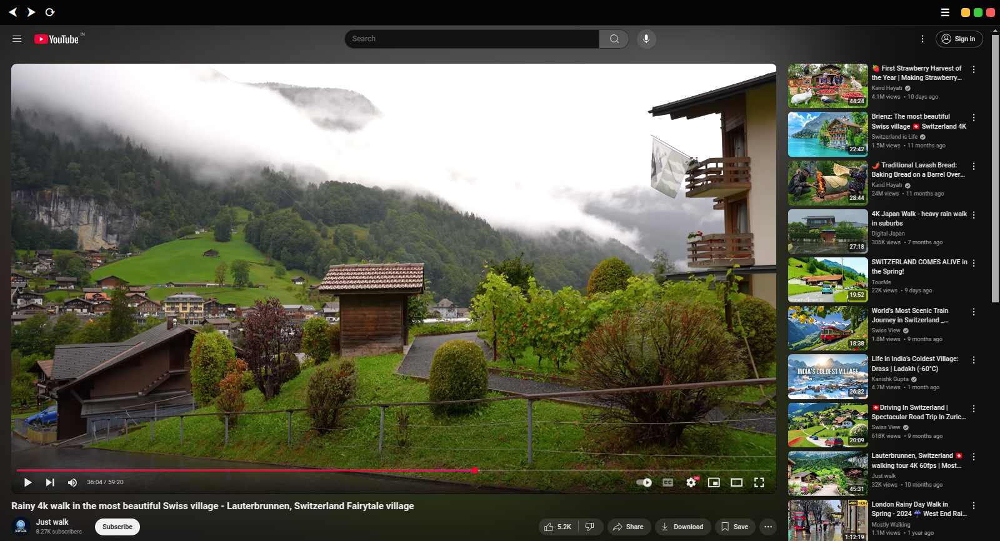

<h1 align="center">YouTubeApp</h1>

<p align="center">
  
</p>

<p align="center">
  
</p>

<p align="center">
  
</p>


-orange)


[](https://github.com/ghostery/adblocker)

---

## 🎬 Overview

YouTubeApp is a lightweight Electron-based desktop client designed for a **fast, clean, and distraction-free YouTube experience**.

It uses **comprehensive filter-list based ad blocking** to ensure minimal interruptions and optimal playback.



---


## ✨ Features

* 🧭 Clean, minimal UI with custom window controls
* 🛡️ Advanced ad-blocking (Ghostery, uBlock, and Brave filters)
* ⚡ Persistent caching for fast startup (~50ms)
* 🧹 One-click browsing data cleanup
* 🔍 Zoom controls
* 🔒 Privacy-focused design

---

## 🧠 Architecture

### 🔹 Ad-Blocking System

* **Filter Engine**

  * Powered by `@ghostery/adblocker-electron`
  * Uses EasyList, EasyPrivacy, uBlock, and Brave filters

---

### ⚡ Caching System

* Binary cache stored in user data directory
* First run: ~1.5s initialization
* Subsequent runs: ~50ms startup

---

### 🔄 Execution Flow

```text
Initialize Adblock Engine
        ↓
Load from Cache (if available)
        ↓
Attach to Electron Session
        ↓
Load YouTube
```

---

## ⚙️ Performance

* Reduced startup latency via caching
* Singleton-style adblocker design
* Minimal runtime overhead

---

## 🧰 Tech Stack

* Electron
* @ghostery/adblocker-electron
* uBlock Origin filter lists
* Vanilla JS, HTML, CSS

---

## 📦 Installation

```bash
sudo dpkg -i youtube*.deb
```

**Tested on:** Ubuntu 22.04 LTS+

---

## 📁 Project Structure

```bash
YouTubeApp/
├── assets/
├── scripts/
├── main.js
├── preload.js
├── index.html
├── adblocker.js
└── package.json
```

---

## ⚠️ Known Limitations

* Depends on YouTube’s frontend (can break with updates)
* Ad-blocking may require adjustments over time
* Limited cross-platform support
* Not production-focused


---

## Disclaimer

This is a personal project intended for experimentation and individual use.
Long-term maintenance and compatibility are not guaranteed.
This project is an independent application and is not affiliated with, endorsed by, or associated with Google LLC or any of its subsidiaries, including YouTube.

---

## 👤 Author

Made with ❤️ by cx051

---

## 📜 License

ISC License

---

